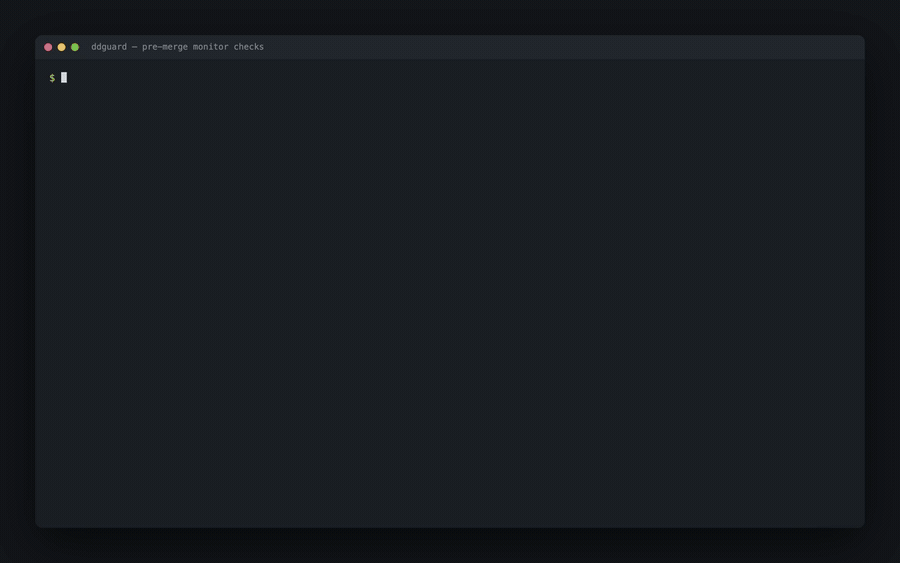

# ddguard

Catches Datadog monitors that will never fire, before they merge.

Datadog's Terraform provider validates monitor queries during `plan`. It checks **syntax only**.
This applies cleanly, shows up green in the monitor list, and pages nobody, forever:

```hcl
query = "avg(last_5m):avg:this.metric.does.not.exist{env:prod} > 90"
```

Green does not mean healthy. Green means *"no evaluation produced a value above the threshold"* —
which is also exactly what *"no evaluation has ever happened"* looks like. You find out during the
outage.

`ddguard` reads a Terraform plan and answers three questions Datadog cannot answer at plan time:
**will this monitor ever fire, how often would it have fired last month, and will anyone hear it.**



## Try it

No Datadog account, no API keys, no `terraform` binary:

```bash
make demo
```

```
ddguard  ·  8 monitors  ·  3 failed  ·  4 warnings

FAIL  datadog_monitor.worker_processed_drop
      [P1][worker] Jobs processed drop
      liveness  NO_SERIES
      Query returned 0 series over the last 24h — this monitor can never fire.
      metric: worker.runs.procesed
      → Did you mean worker.runs.processed?

FAIL  datadog_monitor.scheduler_queue_rate
      [P2][scheduler] Queue rate below floor
      liveness  NO_SERIES
      Query returned 0 series over the last 24h — this monitor can never fire.
      metric: scheduler.runs.queued
      → scheduler.runs.queued exists but reports nothing for {env:prod, service:scheduler} — check the scope tags.

FAIL  datadog_monitor.nginx_5xx_rate
      [P1][nginx] 5xx rate high
      handles  HANDLE_UNRESOLVED
      @pagerduty-nginx-onclal does not resolve to a configured integration — notifications are silently dropped.
      known: worker-oncall, nginx-oncall, scheduler-oncall
      → Did you mean @pagerduty-nginx-oncall?

WARN  datadog_monitor.worker_queue_latency
      [P2][worker] Queue latency high
      backtest  BACKTEST_TOO_NOISY
      30-day backtest: 1273 transitions (4 single-evaluation flaps) ≈ 297 pages/week
      reconstructed from 30s points, not Datadog's own evaluation history
      → at critical=768 (p99.8) this would have fired 20 times instead of 1273

PASS  datadog_monitor.worker_dead_letters
      [P1][worker] Dead-lettered jobs (demo)
      config ✓  liveness ✓ (1 series)  handles ✓  backtest ✓ (1 transition in 30d)
```

Eight fixture monitors: one deliberately correct, seven carrying one real defect each.

## What it checks

| Check | Catches |
|---|---|
| `liveness` | Query returns zero series — typo'd metric, wrong scope tag, group-by that matches nothing |
| `handles` | `@pagerduty-paymnets` — Datadog drops unresolvable handles silently, at every layer |
| `config` | Missing `critical_recovery`, `no_data_timeframe` under 2× the window, grouped monitors with no `new_group_delay` |
| `backtest` | Replays 30 days through the state machine: monitors that never fire, and monitors that fire 700 times |

## The backtest

The part that isn't a linter. It replays the monitor's own query, window, threshold and recovery
against 30 days of history, runs the state machine, and counts real `OK → ALERT` transitions:

```
30-day backtest: 1273 transitions (4 single-evaluation flaps) ≈ 297 pages/week
reconstructed from 30s points, not Datadog's own evaluation history
→ at critical=768 (p99.8) this would have fired 20 times instead of 1273
```

Figures above are from the recorded run; they drift slightly between runs because the fixture
data is anchored to the current time.

That suggested threshold is **searched, not sampled from a percentile ladder** — which matters more
than it sounds. p99 of N buckets leaves N/100 buckets above the line by construction, so on a 30-day
5-minute series a p99 threshold yields ~86 crossings *regardless of the metric*. The thresholds that
actually quiet a monitor live around p99.8. A fixed p90/p95/p99 ladder can never reach them.

A candidate that fires zero times is never suggested. Recommending a monitor that never fires is the
thing this tool exists to prevent.

## Against real Datadog

Same code path, one environment variable:

```bash
export DD_API_URL=https://api.datadoghq.com
export DD_API_KEY=... DD_APP_KEY=...

terraform plan -out=tfplan
terraform show -json tfplan > plan.json
node ddguard/bin/ddguard.js plan.json
```

Exit `0` clean · `1` findings that should block the merge · `2` ddguard could not do its job.
`--format=markdown` for a PR comment, `--format=json` to pipe, `--no-backtest` to skip the slow
check, `--days=N` to widen it.

### When the API is down

Network checks fail open. One unreachable endpoint degrades that check to a `CHECK_UNAVAILABLE`
warning rather than failing your PR, because a flaky API is not a reason to block a merge.

That stops at total failure. If the credentials are rejected (401/403), or not one monitor could be
verified, ddguard exits `2` and says so — a run where nothing could be checked must not be
indistinguishable from a run where nothing was wrong. The header line always reports how many
monitors went unverified.

## Wiring it into CI

`.github/workflows/ci.yml` runs ddguard against `fixtures/tfplan.json`, which is deliberately
broken. That is a demo — it asserts the seeded defects are still caught. It is not a gate, and a
workflow that gates on a fixture would pass every PR in your repo forever.

The gate belongs in the repo holding your monitors, and runs against that PR's own plan:

```yaml
name: monitor-gate

on: pull_request

jobs:
  ddguard:
    runs-on: ubuntu-latest
    steps:
      - uses: actions/checkout@v4
      - uses: actions/setup-node@v4
        with:
          node-version: '20'
      - uses: hashicorp/setup-terraform@v3

      - name: ddguard
        shell: bash
        env:
          DD_API_URL: https://api.datadoghq.com
          DD_API_KEY: ${{ secrets.DD_API_KEY }}
          DD_APP_KEY: ${{ secrets.DD_APP_KEY }}
        run: |
          set -o pipefail
          terraform init -input=false
          terraform plan -input=false -out=tfplan
          terraform show -json tfplan > plan.json
          make gate PLAN=plan.json | tee -a "$GITHUB_STEP_SUMMARY"
```

`shell: bash` and `set -o pipefail` are load-bearing, not boilerplate. The default shell for `run:`
is `bash -e {0}` with no `pipefail`, so `tee` returns 0, ddguard's exit code is discarded, and the
gate passes on every PR while looking green. If you take one line from this file, take that one.

## mockdd is a demo shim

`mockdd/` is a small server that speaks Datadog's API shapes over 30 days of generated fixture data,
so `make demo` works on a clean checkout with no signup. **It is not a metrics database and does not
pretend to be one.** It exists so the tool can be seen working in one command.

The metric names it serves (`worker.runs.processed`, `nginx.requests`, `worker.queue.latency`)
are the shapes a scheduler, queue worker and edge proxy actually emit, so the fixture monitors
read like monitors someone would really write.

## Layout

```
ddguard/       the CLI — plan parser, query parser, four checks, reporters
mockdd/        Datadog-shaped API + fixture generator
fixtures/      monitors.tf and the tfplan.json ddguard reads
demo/          the recording and the script that produces it
IMPLEMENTATION.md   design decisions and contracts
```

Node, CommonJS, no runtime dependencies. `npm test` — 42 tests.

## Limitations

- `query alert` monitors only. Log, APM, composite and SLO monitors are skipped silently.
- `fixtures/tfplan.json` is maintained by hand alongside `monitors.tf`; there is no `terraform`
  binary in this repo to regenerate it.
- The backtest is a reconstruction, not a replay of Datadog's own evaluation history. It fetches
  history in chunks sized to avoid the query API's automatic rollup, then rolls the monitor's
  window forward at its evaluation cadence. When the API still returns points coarser than the
  window, it reports that it cannot reconstruct rather than producing a verdict from rolled-up
  values. Long ranges at short windows may be truncated to keep resolution; the finding says so.
- Only `@pagerduty` handles are verified. Datadog exposes Slack channels only per account and
  documents no endpoint listing accounts, so `@slack` handles are counted and reported as
  unverified rather than guessed at.
- `make demo` reports ddguard's exit code rather than propagating it, so the recipe reads cleanly.
  `make check` propagates; `make gate` is the same thing without mockdd.
